# Handoff for Visual Studio Code

Create and receive Handoffs without leaving VS Code. The extension bundles the
native Go client; a global npm installation is not required.

## Create a Handoff

Open **Source Control**. Every discovered Git repository has its own Handoff
provider and independent draft:

1. Use **+** to move files from **Changes** to **Included in Handoff**.
2. Write a useful message in the native Source Control input.
3. Optionally choose recipients, a team/channel, and private visibility.
4. Press **Ctrl/Cmd+Enter** or choose **Create Handoff**.

Handoff selection never changes Git staging. Draft selections, messages, and
audiences survive a window reload. Clicking a text change opens a diff;
untracked and binary files open normally.

The extension discovers nested repositories, multi-root workspaces, worktrees,
and multiple clones through VS Code's built-in Git extension. Each repository
keeps its own branch, changes, message, and destination.

## Receive a Handoff

The Handoff Activity Bar contains the multi-repository Inbox. Incoming items
are grouped by compatible local repository using the stable repository ID.
When several clones match, Handoff asks which clone should receive the changes;
an unrelated repository cannot be selected.

Inbox actions include search, repository/author/branch/age/compatibility/team/
outbox/assignment filters, sorting, read/unread, server-backed archive and
restore, comments, assignment, expiry, acknowledgement, applied state, audit
history, revoke, delete, and copyable VS Code deep links. Background refresh
can notify you about new compatible items.

Every pull shows sender metadata, changed paths, branch/base compatibility,
existing receiver changes, and likely path conflicts before applying anything.
Existing local work is preserved. If Git reports a conflict, the Inbox exposes
the affected repository, conflicted files, Continue, and Abort.

## Setup and profiles

Run **Handoff: Configure Server Profile**. Tokens are stored in VS Code Secret
Storage. A workspace folder can select a profile with `handoff.profile`, so
different repositories can use different team servers.

Useful settings:

- `handoff.exclude`: additional draft exclusion globs.
- `handoff.repositorySearchDepth`: nested repository discovery depth.
- `handoff.largeFileWarningBytes`: large-file warning threshold.
- `handoff.confirmLowRiskPull`: confirmation for low-risk pulls.
- `handoff.pollIntervalSeconds`: background Inbox refresh interval.
- `handoff.desktopNotifications`: notifications for new compatible items.
- `handoff.binaryPath`: development-only custom client path.

Use **Handoff: Copy Diagnostic Information** and **Handoff: Show Output** when
reporting a problem. Tokens are redacted from diagnostics and logs.

## Requirements

- VS Code 1.95 or newer.
- VS Code's built-in Git extension enabled.
- Git installed in the local, WSL, SSH, or Dev Container workspace where the
  extension runs.
- Access to a compatible Handoff server.

The extension runs on the workspace side, so remote repositories use the
binary packaged for that remote environment.
